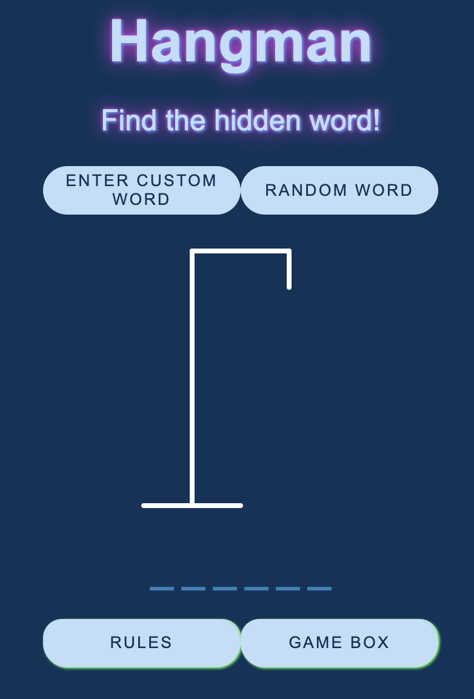
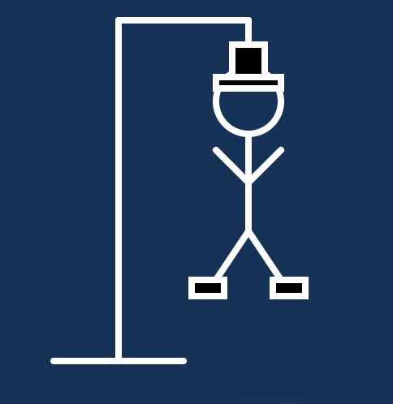

# Hangman!

## License
### 
### [MIT](https://opensource.org/licenses/MIT)

## Description

Classic Hangman style game created with React. Players can create their own word or choose randomly from a pool of words.

By: [Vincent Toon](https://github.com/Vincenttoon)

## Table of Contents

* [Live Link](#live-link)

* [Installation](#installation)

* [Usage](#usage)  

* [Things Learned](#things-learned)

* [Contributors](#contributors)

* [Questions?](#questions)

## Live Link

* [Hangman Live Link](https://hangman-vwtd.vercel.app/)

## Installation

* Head to the repository to download or view this code: [Hangman](https://github.com/Vincenttoon/hangman-adam-page)

## Usage

* User can make their own word and play with friends or select a random word.

* Player gets 9 guesses to guess the correct word

* Player cannot guess the same letter twice!

* Remember, have fun!

## Things Learned

* Further application of `useState`, `useEffect`, `useRef`

* `Transform` in CSS

* More practice deconstructing functions and components

* Implementation in moving a single page JS application to full scale React App

## Contributors

* Random word bank from [Alpha Tangos Gist](https://gist.github.com/alpha-tango/c3d2645817cf4af2aa45)

## Questions?

Questions, comments, or concerns? Please Email me at:
* vincenttoon22@gmail.com